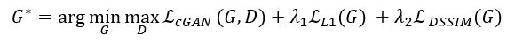

# TeamChallenge Image analysis
Github repository for TUe/UU MIx Team Challenge - team 6

We developed a software that can be used as a clinical tool to reverse the anatomical distortion caused by an edema (a pathological brain swelling due to an ischemic stroke) for a diffusion weighted magnetic resonance image of zero b-value weighting (DWI_b0 MR image) of a rat brain. Therefore, no image of the “healthy brain” is needed during inference. The found deformation can also be quantified. Reversing this effect would improve prognoses and would make it easier to extract valuable information from the images. The research problem is approached as a 2D image-to-image translation task: From “edema” (day3) to “non-edema” (day0). In the last couple of years, generative adversarial networks (GANs) have been found to be very competitive in this field (especially for more complex problems). The software is based on a conditional GAN (cGAN) called Pix2Pix [[1]](#1). We opted for a cGAN since these are well-suited for image-to-image translation tasks, and specifically Pix2Pix because it has been shown to perform well in a wide variety of these tasks.

## Input
The necessary file structure to run the example notebook with using the corresponding scripts can be found below (the used dataset is not publicly available).

**Proper file structure:**
```
|--- data --- FSL_results / *       % Directory used to store results from run_all_FNIRTs.sh 
|          | 
|          -- preprocessed / *      % Directory used to store preprocessed data
|          | 
|          -- raw / *               % Directory used to store raw (immutable) data
|          | 
|          -- referencerat / *      % Directory used to store atlases
|	   |
|	   -- responsvecs.xlsx      % Excel file containing physical metrics per subject
| 
|--- models / *                     % Directory used to store model weights
|
|--- logs / *                       % Directory used to store training logs (tensorboard)
|
|--- notebook / *                   % Directory used to store notebooks
|
|--- src / *                        % Directory used to store source code
|
|--- util / *                       % Directory used to store basic utility files
|
|--- .gitignore                     % gitignore
|--- LICENCE                        % The MIT licence file
|--- README.md                      % This README
```

For training of the cGAN, the DWI_b0 images of day3 and day0 are necessary, these are formatted correctly using `preprocessing.py`.  Firstly, FSL’s brain extraction tool (BET) [[2]](#2) is applied to isolate the brain to simplify the problem for the model. Additionally, the resulting images are linearly registered using FLIRT [[3]](#3) [[4]](#4) for the same reason. The BET should be performed manually by the user whereas the FLIRT can be executed by running the provided `run_all_FNIRTs.sh` bash script. The used dataset consists of 25 slices per rat, since the deformation is expected to differ depending on the slice, only the middle 3 slices are considered (this is assuming that these slices deform in a similar manner) in `data_preperation.py`. Additionally, the brains are cropped and a histogram equalization is applied for inter-subject intensity consistency. Fairly aggressive data augmentation using Gryds [[5]](#5) is applied in `augmentation.py` to tackle the problem of a small dataset and for model robustness. The random augmentations consist of realistic (subjectively determined to be anatomically plausible) translation, rotation, B-spline transformation, horizontal flipping, and Gaussian noise.

## Training
Since training, as well as evaluation, of GANs are notoriously difficult and time consuming, the architecture (adapted from [[6]](#6)) and hyperparameters are based on the widely used Pix2Pix model. However, as will be discussed later, since the structural dissimilarity metric (DSSIM) is used as a quantification of the deformation (so between day3 and predicted day0), the DSSIM between the predicted day0 and the true day0 should be minimized during training for a fair quantification. For that reason, a 1-SSIM loss term is introduced as an extra regularization term in the objective function:



With generator G, discriminator D, and loss weights λ1 and λ2. Details about the definitions can be found in [[1]](#1). The DSSIM is based on the standard SSIM implementation from [[7]](#7). Training only stops after the specified number of steps since there is generally not a clear convergence criterion for GANs. The final model architectures and the training setup can be found in `model_util.py` and `train_util.py` respectively. 

## Evaluation and quantification
During training, multiple models are saved. The best performing model must be determined qualitatively based on the generated images for the training and independent validation set that are saved to Tensorboard. After determining which model (i.e. at which step) performed the best, it can be evaluated using an independent test set. As mentioned before, this is done using DSSIM. Ideally, the predicted day0 is identical to the true day0 which would give a DSSIM of 0. Then, the quantification of deformation due to the edema is quantified by computing the DSSIM between the predicted day0 and day3. This quantification relies on the assumption that the differences between the day3 and day0 images are only caused by the stroke. So, the higher the DSSIM here, the more deformation occurred. The corresponding generated day0 images of the test set are also shown.
	
To validate whether the model with the DSSIM metric captured and reversed the deformation, the resulting DSSIM are correlated with measured physical metrics (hemispheric lesion volume, measure of behavioral outcome, and degree of blood brain barrier leakage). If there is a significant correlation between the DSSIM and any of these physical metrics, that tells us that the model has learned something valuable. All the evaluation methods are defined in `eval_util.py`.

## References
<a id="1">[1]</a> 
Isola, P., Zhu, J. Y., Zhou, T., & Efros, A. A. (2017). [Image-to-image translation with conditional adversarial networks](https://doi.org/10.1109/CVPR.2017.632). In Proceedings - 30th IEEE Conference on Computer Vision and Pattern Recognition, CVPR 2017 (Vol. 2017-Januari, pp. 5967–5976). Institute of Electrical and Electronics Engineers Inc. 

<a id="2">[2]</a> 
Smith, S. M. (2002). [Fast robust automated brain extraction](https://doi.org/10.1002/hbm.10062). Human Brain Mapping, 17(3), 143–155. 

<a id="3">[3]</a>
Jenkinson, M., Bannister, P., Brady, M., & Smith, S. (2002). [Improved Optimization for the Robust and Accurate Linear Registration and Motion Correction of Brain Images](https://doi.org/10.1006/nimg.2002.1132). NeuroImage, 17(2), 825–841. 

<a id="4">[4]</a>
Jenkinson, M., & Smith, S. (2001). [A global optimisation method for robust affine registration of brain images](https://doi.org/10.1016/S1361-8415(01)00036-6). Medical Image Analysis, 5(2), 143–156. 

<a id="5">[5]</a>
Eppenhof, K. A. J., & Pluim, J. P. W. (2019). [Pulmonary CT Registration Through Supervised Learning With Convolutional Neural Networks](https://doi.org/10.1109/TMI.2018.2878316). IEEE Transactions on Medical Imaging, 38(5), 1097–1105. 

<a id="6">[6]</a>
Radford, A., Metz, L., & Chintala, S. (2016). [Unsupervised representation learning with deep convolutional generative adversarial networks](https://arxiv.org/abs/1511.06434v2). In 4th International Conference on Learning Representations, ICLR 2016 - Conference Track Proceedings. International Conference on Learning Representations, ICLR.

<a id="7">[7]</a>
Wang, Z., Bovik, A. C., Sheikh, H. R., & Simoncelli, E. P. (2004). [Image quality assessment: From error visibility to structural similarity](https://doi.org/10.1109/TIP.2003.819861). IEEE Transactions on Image Processing, 13(4), 600–612. 

